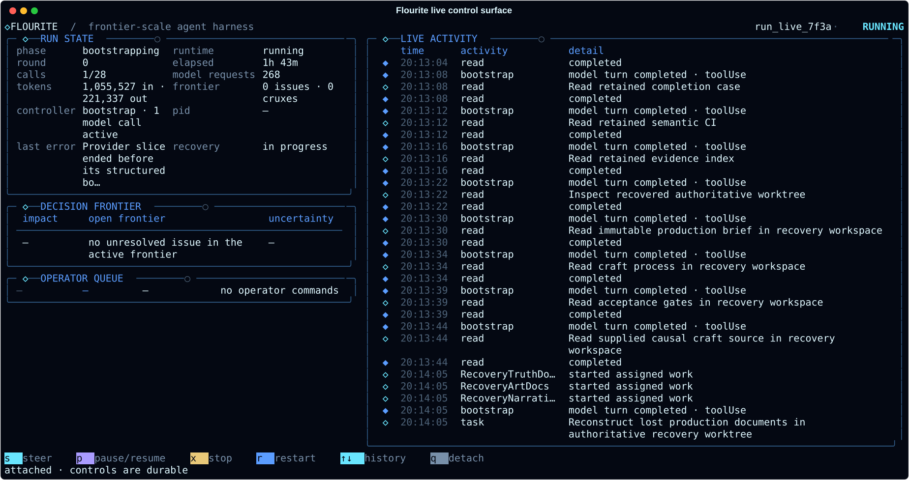
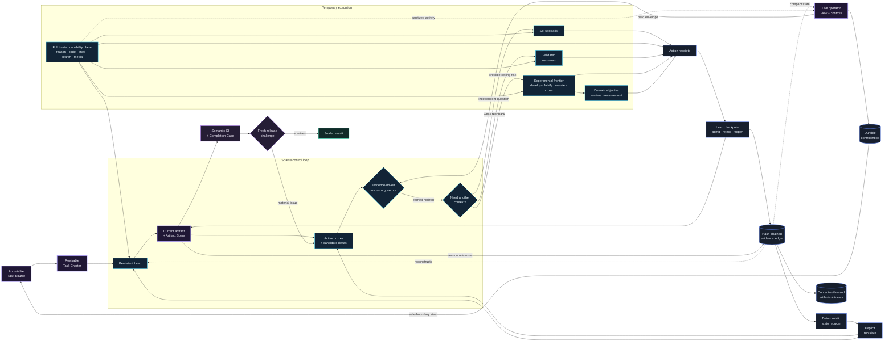

<p align="center">
  
</p>

Flourite is an agent harness for the kind of problem where one good model
attempt gets close, but not close enough.

Most harnesses answer that by spawning more agents, collecting more candidates,
and asking another model to pick a winner. Flourite works the other way. It
builds one complete artifact, finds the handful of unresolved decisions actually
holding it back, and spends tools, research, tests, and specialist calls only
where the outcome could change one of them.

You get back one answer instead of a pile of candidates, and a record of why
every expensive step was taken.

[Quick start](#quick-start) · [How it works](#how-it-works) ·
[Live control](#watch-and-steer) · [Commands](#commands) ·
[Canonical model](docs/CANONICAL_MODEL.md) ·
[Architecture](docs/V3_5_ARCHITECTURE.md) ·
[Frontier velocity](docs/FRONTIER_VELOCITY.md) ·
[Autoresearch](docs/AUTORESEARCH.md) ·
[Operations](docs/OPERATOR_GUIDE.md) · [Security](SECURITY.md)

Sol gets the full machine: shell, editing, LSP, browser, web research, and
bounded subagents. Flourite supplies what a single session cannot — state that
survives an interruption, a principled reason to stop, and a ledger you can
audit afterwards.

Flourite is an independent open-source project, not an OpenAI product.

<p align="center">
  
</p>

<p align="center"><sub>Live control surface during an automatic recovery. The run keeps working while its state remains inspectable and steerable.</sub></p>

> [!CAUTION]
> Trusted mode gives the model the permissions of the current user. Run it in a
> dedicated VM, VPS, or disposable machine without unrelated secrets or
> workloads. Read [SECURITY.md](SECURITY.md) before using it elsewhere.

```console
$ flourite run --adapter research --source brief.md --output answer.md \
    "Find the strongest defensible answer."

◇ ORIENT       building the first complete solution
◆ BASELINE     3 active issues · 2 proposed actions
◇ FOCUS        2 decision-relevant actions selected
◇ INTEGRATE    reducing evidence into the current artifact
◇ CRYSTALLIZE  rebuilding one coherent deliverable
◆ CHALLENGE    release case passed
◆ SEALED       answer.md
```

## Why Flourite

| Ordinary harness pattern | Flourite |
| --- | --- |
| Generate many independent answers | Maintain one current best artifact |
| Scale with available agent count | Scale only with distinct unresolved decisions |
| Let critics produce more prose | Run probes whose outcomes can change a decision |
| Treat the conversation as memory | Reconstruct state from explicit, verified records |
| Repeatedly hill-climb one candidate | Keep a small measured frontier that can falsify, mutate, or cross real candidate states |
| Stop when the loop or budget ends | Stop when the release case survives a fresh challenge |

Flourite is not a permanent swarm, a debate club, or a workflow graph. The
normal path stays close to one good agent doing one hard task, and widens only
when the shape of the problem earns it.

## What makes it work

- **The task never drifts.** The original task is immutable. Flourite can
  change how it represents or approaches the problem, but it cannot quietly
  swap the destination for an easier one. Explicit requirements, prohibitions,
  evidence demands, and process gates are traced into release-blocking
  obligations rather than compressed into a lossy summary.
- **Concurrency follows the problem, not the hardware.** A small live frontier
  tracks the load-bearing unknowns. Work fans out when there are genuinely
  separate decisions to settle, not because cores happen to be free.
- **Compute has to earn its next horizon.** The configured call budget is a
  hard operator ceiling, not a quota or a phase script. Flourite starts with a
  derived working grant and expands it only when the ledger shows new
  discriminative evidence, measured objective improvement, or a semantic
  advance confirmed by the Frontier Keeper. Rewritten bytes and model-declared
  importance do not count as progress.
- **Thought is the cheapest search space.** The solver generates and kills
  possibilities mentally before retrieval, execution, or verification. More
  expensive media must name the residual that thought cannot settle and the
  decision their result can change.
- **A tool beats a second opinion.** Sol can inspect, edit, execute, browse,
  research, debug, evaluate, and delegate. Where a deterministic check exists,
  Flourite runs it rather than asking another model what it thinks. Evidence
  also states what modality it observed and what it cannot establish.
- **Findings land or get rejected.** Each one is checked against explicit
  obligations and then folded into the single artifact. Nothing is left lying
  around as branch debris.
- **Wider search has to be earned.** When a concrete ceiling risk justifies it,
  Flourite develops a bounded set of real candidate states and falsifies,
  mutates, or crosses them. Runtime measurements decide what survives, not the
  model's opinion of its own work.
- **The ledger is the source of truth.** Run state is rebuilt from a
  hash-chained ledger and content-addressed artifacts, never from whatever the
  Lead happens to remember.
- **Finishing is a gate, not a timer.** Semantic checks, obligation coverage,
  and one fresh artifact-bound release challenge can each block a result. A
  repair must face a new challenge. Software changes stay isolated until you
  explicitly apply a verified patch, while declared generated files are kept as
  durable deliverables beside it.

## Compared with

The table above contrasts a pattern. This one names projects, because that is
usually what you are actually choosing between.

| Compared with | Why use Flourite | Use the other tool when |
| --- | --- | --- |
| [AutoGPT](https://github.com/Significant-Gravitas/AutoGPT) and open-ended autonomy loops | The task is fixed, the stopping condition is a release challenge rather than a step limit, and every expensive call has a recorded reason. | You want an agent to roam and see what it finds. |
| [LangGraph](https://github.com/langchain-ai/langgraph) and agent frameworks | It is a harness with an opinion, not a toolkit for assembling your own graph. Nothing to design before your first run. | You are building a product and want to own the control flow yourself. |
| [CrewAI](https://github.com/crewAIInc/crewAI) and role-playing multi-agent setups | Concurrency follows unresolved decisions rather than a cast of personas, so most runs stay close to one good agent. | Your problem really does decompose into stable, separate roles. |
| [OpenHands](https://github.com/All-Hands-AI/OpenHands), [SWE-agent](https://github.com/SWE-agent/SWE-agent), [Aider](https://github.com/Aider-AI/aider) | Software is one adapter, not the whole product; the same loop handles research, design, and formal work. | Your work is only ever code, and you want an editor-shaped workflow. |
| Hosted deep-research features | It runs on your machine, keeps an auditable ledger, and produces a sealed artifact you can verify later. | You want an answer in a chat window with nothing to install. |

## Quick start

You need:

- Linux and Python 3.11 or newer
- Node.js
- [Codex CLI](https://developers.openai.com/codex) with ChatGPT login
- [Oh My Pi](https://github.com/can1357/oh-my-pi)

```sh
npm install -g @openai/codex @oh-my-pi/pi-coding-agent
codex login

git clone https://github.com/mystxcal/flourite.git
cd flourite
python -m venv .venv
source .venv/bin/activate
python -m pip install .

flourite doctor
```

`doctor` checks the login, OMP version, available Codex models, and every
configured tool name without spending a model token.

Create the starter configuration:

```sh
flourite init flourite.toml
```

It is ready to use as written. The full example is
[examples/flourite.toml](examples/flourite.toml).

## Run a task

For research, decisions, formal work, or a general artifact:

```sh
flourite run \
  --config flourite.toml \
  --adapter research \
  --source brief.md \
  --output answer.md \
  "Produce the strongest defensible result for the exact task."
```

For a repository:

```sh
flourite run \
  --config flourite.toml \
  --adapter software \
  --workspace . \
  --output final.patch \
  "Fix the parser bug, preserve compatibility, and prove the change."
```

Flourite does not modify the source repository during the run. Inspect the
result, then apply it explicitly:

```sh
flourite verify latest
flourite apply latest
```

## Watch and steer

Attach the live control surface from another terminal:

```sh
flourite live latest
```

It shows the current phase, budget, unresolved frontier, model/tool activity,
and operator-command receipts in one compact view. From there you can steer,
pause or resume, stop safely, restart a resting controller, or detach without
affecting the run.

Use `↑`/`↓` or `PgUp`/`PgDn` to browse activity history. New events do not move
the historical view; press `End` to follow live activity again.

The controller terminal follows sanitized model, tool, and nested-worker
activity as it happens. Use `--quiet` when only the material result is wanted.

Steering is not chat pasted into a running model. Flourite queues your
instruction durably, admits it at the next safe boundary, records it in the
immutable Task Source as an amendment, and then runs a fresh integration pass.
Pause and stop wait for those same boundaries, so an in-flight model call is
never silently thrown away.

The same controls work without the dashboard:

```sh
flourite steer latest "Recheck the decisive assumption against primary evidence."
flourite pause latest
flourite resume latest
flourite stop latest
```

## Commands

| Command | Purpose |
| --- | --- |
| `flourite run` | Start one exact task |
| `flourite status` | Show the compact current state |
| `flourite inspect` | Inspect issues, actions, evidence, cost, and provider epochs |
| `flourite live` | Attach the live dashboard and control surface |
| `flourite steer` | Amend direction at the next safe boundary |
| `flourite pause` | Pause at the next safe boundary |
| `flourite stop` | Stop safely while keeping the run resumable |
| `flourite resume` | Continue an interrupted run |
| `flourite extend` | Reopen a sealed run with more budget |
| `flourite verify` | Replay and verify the ledger, blobs, and completion seal |
| `flourite events` | Print the immutable event stream as JSONL |
| `flourite export` | Create a redacted diagnostic or exact audit bundle |
| `flourite apply` | Apply a verified software patch |
| `flourite arena` | Blindly compare matched-budget controllers |
| `flourite evolution-check` | Apply the sealed held-out harness-promotion gate |
| `flourite doctor` | Check the provider, login, models, and tools |
| `flourite demo` | Run the deterministic offline example |

`frontier` remains an install-time compatibility alias. The stable Python API
continues to use the `frontier_harness` import.

## How it works



The normal path is deliberately sparse:

1. Build the smallest real artifact that can expose the next costly mistake.
2. Identify the few uncertainties controlling important improvements.
3. Run only probes whose possible outcomes change a decision.
4. Reduce the evidence into the current artifact.
5. Rebuild one coherent final result.
6. Verify its obligations and challenge the exact release artifact. Local
   defects are repaired; structural failures reopen the earliest bad decision.
   Every changed artifact must survive fresh checks and a new challenge.

The event ledger is authoritative; `state.json` is a derived view. Large
artifacts and traces live in a content-addressed store. A persistent Lead may
remember the conversation, but integrity never depends on that memory.

Every provider epoch records the exact OMP version, model, tool contract,
context hashes, continuity mode, tool trace, token usage, and wall time.
`flourite inspect latest` exposes the high-density view.

Provider timeouts are recovery boundaries, not destructive deadlines. If an
OMP execution slice ends before its boundary response, Flourite continues the
same session; if the call still fails, it stores the workspace delta and trace
before cleanup so a later `resume` starts from the retained work.

The control inbox is a separate sidecar: immutable commands and mutable
receipts are durable, while bounded live activity is presentation state. Only
the active controller writes semantic events to the hash-chained ledger.

## Configuration

The defaults route:

- Lead, synthesis, and fatal-impact work to GPT-5.6 Sol xhigh;
- consequential workers to Sol high;
- cheaper control work to Sol medium.

Trusted mode inherits the VM or VPS environment and uses OMP's automatic
approval mode. Ambient rules, skills, and extensions stay off so the model
receives only the context Flourite records explicitly.

Important controls live under:

- `[run.budget]` for hard call, token, wall-time, and optional round ceilings;
- `[resource]` for evidence-driven working grants inside those hard ceilings;
- `[provider.capabilities]` for tools, network, nested tasks, and retry limits;
- `[cognition]` for obligations, cruxes, overlays, and semantic checks;
- `[summit]` for bounded upper-tail mechanism search.
- `[software.objective]` for an optional domain-owned evaluator whose final
  non-empty output line is JSON.

For measurable software research, configure a primary objective without
turning it into a universal quality score:

```toml
[software.objective]
command = "python evaluate.py --json"
primary_metric = "score"
direction = "maximize"
```

Candidate measurements run outside the model boundary and are compared against
an isolated parent baseline. See [Autoresearch](docs/AUTORESEARCH.md).

New runs live under `.flourite/runs`. Existing `.frontier/runs` remain
discoverable after upgrading.

## Machine output

Human-facing output is append-only and remains readable in logs. Narrow
terminals use a compact mark automatically.

`flourite live` is the explicit full-screen exception: it is an attachable,
disposable projection over durable state. Detaching it never stops the run, and
the ordinary run log remains append-only.

- `--quiet` emits only the material result.
- `status --json` emits only JSON.
- `events` emits only JSONL.
- `NO_COLOR` and redirected output keep the same semantic hierarchy.

The visual grammar is documented in
[Terminal language](docs/TERMINAL_LANGUAGE.md).

## Development

```sh
python -m pip install -e '.[dev]'
pytest -q
ruff check src/frontier_harness tests
mypy src/frontier_harness
```

The release gate also builds the wheel, installs it into a clean environment,
runs the offline end-to-end demo, and verifies the resulting completion seal.

## Project notes

- [Canonical model](docs/CANONICAL_MODEL.md)
- [Architecture](docs/V3_5_ARCHITECTURE.md)
- [Operator guide](docs/OPERATOR_GUIDE.md)
- [Live validation](docs/LIVE_CODEX_VALIDATION.md)
- [Autoresearch](docs/AUTORESEARCH.md)
- [Event model](docs/event-model.md)
- [Changelog](CHANGELOG.md)
- [Contributing](CONTRIBUTING.md)
- [Security](SECURITY.md)

## Related

Same idea, different job — one thing done properly, nothing in the middle,
and a result you can check:

- [Chatinabox](https://github.com/mystxcal/chatinabox) — drive the Codex CLI on your server from Telegram
- [Agentic Word Documents](https://github.com/mystxcal/agentic-word-documents-system) — Word documents built from Markdown and Excel, with a verified PDF

The rest are listed on [my profile](https://github.com/mystxcal).

Flourite is available under the [Apache License 2.0](LICENSE).
