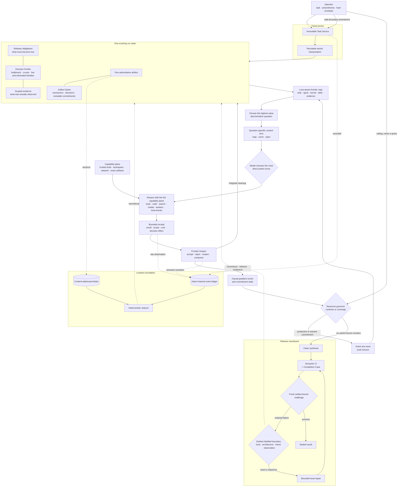

# Flourite, crystallized

This is the canonical conceptual model of Flourite. It is not a tour of the
source tree and it is not a list of features. It is the object the source is
supposed to implement.

> **Flourite holds one task still, evolves one authoritative artifact, makes
> commitments only as hard as the evidence supporting them, and spends compute
> on the few uncertainties preventing a defensible release.**

Everything else is substrate, an optional capability, or an interface.

## The whole object



This is one closed loop around one artifact. It is not a procession of agents
and it is not a fixed workflow graph.

## Canonical state

At any meaningful boundary, the entire run can be understood as:

```text
Xₜ = ⟨T, Aₜ, Sₜ, Oₜ, Fₜ, Eₜ, Ωₜ, Gₜ, Bₜ, Rₜ⟩
```

| Symbol | Meaning | What must remain true |
| --- | --- | --- |
| `T` | Exact Task Source plus its traced, revisable interpretation | The destination cannot drift. |
| `Aₜ` | One authoritative artifact at time `t` | Every accepted improvement lands here. |
| `Sₜ` | Artifact Spine | The central mechanism and decisions remain coherent; every hard commitment can be causally retired by stronger evidence. |
| `Oₜ` | Obligations | Every release requirement has an explicit truth condition and evidence need. |
| `Fₜ` | Decision frontier | Only the bottleneck, active cruxes, live families, eliminated families, and best next move occupy attention. |
| `Eₜ` | Scoped evidence | Observations retain provenance, modality, limits, and the decision they can support. |
| `Ωₜ` | Observation geometry | The run knows which local, sequence, holistic, interactive, temporal, or objective observations can establish each important property—and which proxies cannot. |
| `Gₜ` | Causal gradient | Progress remains a vector of quality, information, feasibility, exploration, and reliability movement with attribution and delayed commitments intact. |
| `Bₜ` | Compute state | The operator owns the hard ceiling; the run earns access to it horizon by horizon. |
| `Rₜ` | Recovery state | A material failure is routed to the earliest falsified boundary rather than translated into symptom-level patch work. |

The Frontier Kernel is the dense core of `Fₜ`:

```text
controlling bottleneck
durable working invariants
explicit revisions of disproved invariants
live hypothesis families
eliminated families + failure mechanisms + reopening conditions
best next move
the completed actions that caused this revision
```

It is working memory, not a transcript summary and not a knowledge base.

## The transition law

One iteration is conceptually small:

```text
mapₜ    = frontier_map(Xₜ)
qₜ      = highest_value_discriminative_question(mapₜ)
viewₜ   = loss_aware_zoom(Xₜ, qₜ)
moveₜ   = model_selects_move(qₜ, viewₜ, capabilities)
resultₜ = observe(execute(moveₜ))
deltaₜ  = keeper_integrates(Xₜ, resultₜ)
Gₜ₊₁   = causally_attribute(deltaₜ, resultₜ, qₜ)
Xₜ₊₁   = reduce(ledger + deltaₜ + Gₜ₊₁)
```

The governing law is:

> Select the question with the greatest decision leverage, discrimination,
> unlock value, and credible observation path. Give an intelligent model the
> strongest relevant context and its full capability plane, then let it choose
> the most direct potent move. Preserve what the result teaches—even when
> rejected. Continue only while causal gradient or an earned bounded
> commitment justifies another horizon.

Two corollaries prevent the loop from becoming locally intelligent and
globally stupid:

> **No commitment may be harder to revise than the evidence that justified it.**

> **Every failure backpropagates to the earliest upstream decision it actually
> falsifies; only genuinely local failures remain local.**

An action therefore begins with a small intent contract:

```text
the decision it targets
the question being asked
the materially different possible outcomes
what each outcome would change
decision leverage and downstream unlocks
option value if the preferred outcome fails
the observation channel when the answer depends on observation
how that observation's potency will be established when this is an experiment
whether this is one step of a bounded delayed-payoff commitment
the cost and stopping condition
```

Only fields that affect the decision are required. A direct construction need
not masquerade as an experiment, a tool call need not justify its existence in
prose, and a reasoning action keeps the same tools as every other action.

A provider process is an execution vessel, not a semantic unit of progress. It
may contain many reasoning turns, tool calls, compactions, or nested tasks, but
it owns only the current move and its stop condition. It must yield at a stage
crossing so the ledger can integrate evidence before the same context hardens
its own conclusion. Request and token counts remain visible as cost; they do
not become accomplishments.

Its receipt records what actually happened, what the observation can and cannot
establish, what changed, what it cost, and whether it was integrated. The
runtime binds the receipt to the exact view, artifact parent, instruments, and
raw outputs that produced it.

## Map, choose, zoom, act

The runtime must not confuse choosing a question with choosing how cheaply to
answer it.

### Map

Construct a constant-budget frontier map from the immutable task, Artifact
Spine, Frontier Kernel, obligations, evidence coverage, active commitments,
and relevant failure residue. It shows where leverage and uncertainty live
without pretending to contain all underlying detail.

### Choose

Rank only non-dominated questions. Preserve the dimensions rather than hiding
them in a universal score:

1. task consequence and failure avoided;
2. discrimination among materially different possibilities;
3. downstream unlock and option value;
4. observation potency and interpretability;
5. feasibility and reversibility;
6. accepted-result cost and reversibility.

A cheaper question does not outrank a consequential one merely because it is
cheap. Cost breaks close calls and constrains the horizon; it does not choose a
smaller problem simply because that problem is convenient to measure.

### Zoom

Build a question-specific context lens containing:

```text
exact task and amendments
Artifact Spine and relevant full-artifact or regional view
Frontier Kernel and targeted cruxes
obligations, dependencies, and observation requirements
relevant positive and negative evidence
known omissions plus paths to exact raw material
the action and stopping contract
```

The lens is an auditable projection, never an authority. It declares what it
included, what it omitted, and where the omitted lossless state can be opened.
Global or holistic questions receive a global view; the system must not use a
targeted slice to make a whole-artifact judgment.

### Act

Only after the question and view are fixed does the model choose how to attack
it. Reasoning, retrieval, code, shell, search, browsing, media inspection, and
specialist calls are composable within one turn. `epistemic_mode` is an
attention hint and an observability label, never a tool permission. Flourite
removes unavailable or unsafe capabilities at the provider boundary; it does
not domesticate a trusted model by making it ask the controller for ordinary
tools.

## The loop, mentally executed

1. **Bind the task.** Capture the exact request and explicit amendments as the
   immutable Task Source. Compile deterministic guard obligations from its hard
   requirements.
2. **Make the smallest decisive reality early.** The Lead constructs the
   cheapest artifact capable of falsifying the highest-leverage architectural
   choice: a study set, representative sequence, vertical slice, prototype, or
   complete artifact as uncertainty permits. It does not build five minutes to
   learn what twenty seconds could have disproved.
3. **Define observation geometry.** State how each important property can be
   observed at its real scope and modality, including proxies that must not be
   mistaken for it.
4. **Expose the frontier.** Derive the Artifact Spine, release obligations, and
   the one to three uncertainties that control the largest consequential
   decisions. Keep dormant structure losslessly outside active attention.
5. **Map and choose.** Select the highest-value discriminative question, not
   merely the cheapest actionable one. Dominated, correlated, stale, weakly
   observable, or non-actionable work does not run.
6. **Compose the context lens.** Give that question the smallest loss-aware view
   that preserves every load-bearing dependency and a route to exact detail.
7. **Let intelligence use the capability plane.** The model chooses and
   combines reasoning and tools freely. It should use a tool whenever the tool
   makes the answer faster, truer, more concrete, or more powerful; it should
   skip a tool when the tool would only create ceremony. The harness supplies
   focus and evidence boundaries, not learned helplessness.
8. **Observe, do not merely opine.** A worker, tool, instrument, or bounded
   alternate lineage returns a scoped receipt and any candidate artifact delta.
9. **Integrate once.** The Frontier Keeper accepts, rejects, or reopens claims,
   obligations, and directions; updates the one artifact and its spine; and
   compresses the new frontier without erasing causal failures.
10. **Attribute movement.** Preserve separate quality, epistemic, feasibility,
    exploration, and reliability deltas. Attribute them to exact actions and
    interactions; activity is not gradient.
11. **Grant, honor, or converge.** Live gradient earns a small horizon. A
    pre-registered delayed-payoff commitment continues only while its
    intermediate predictions hold and its kill condition does not. Otherwise
    the loop converges into release.
12. **Seal or backpropagate.** Clean synthesis, deterministic checks,
    obligation-by-obligation Completion Case, and a fresh digest-bound challenge
    either seal the exact artifact or locate the earliest falsified boundary.
    Local defects receive a bounded repair; architectural defects reconstruct;
    representation defects reframe; invalid measurements reobserve. Every new
    proposition faces a fresh challenge.

## Commitments are evidence-qualified

The Artifact Spine is a compact causal model, not scripture. Each governing
decision begins provisional and becomes harder only when evidence at the same
scope supports it. Its lifecycle is:

```text
propose ── discriminate ── support ── depend on
   │                         │             │
   └──────── falsify ────────┴── retire + reopen dependants
```

Omission never deletes a commitment. Retirement requires an explicit revision
that names the old statement, the failure mechanism, the supporting evidence,
and any replacement. The ledger preserves the superseded commitment and its
cause. Obligations, cruxes, eliminated families, and artifact structure that
depended on it reopen together.

A construction Lead may propose a commitment, but cannot promote a qualitative
whole-artifact architecture solely with its own correlated judgment. Before an
expensive or hard-to-reverse build crosses such a stage gate, a fresh Keeper
examines a representative artifact in the modality where failure would appear.

## Capability amplification, not project-wide ceremony

The available moves form a palette, not a gated ladder:

```text
recall · think · retrieve · inspect · execute · build · verify
```

It is not a phase sequence. A question may start with a shell probe, move into
reasoning, inspect a visual artifact, edit code, and verify the result in one
continuous act. A pure conceptual question may stay entirely in thought. The
model is trusted to navigate; the runtime observes actual cost and evidence
afterward and intervenes only when repeated behavior proves unproductive.

Execution topology is selected the same way:

| Shape revealed by the question | Minimum sufficient capability |
| --- | --- |
| Tightly coupled reasoning or construction | Persistent Lead |
| Independent evidence questions | Small temporary worker batch |
| Exact calculation, transformation, search, or check | Model with its native tool plane |
| Weak or missing observation channel | Build and validate an instrument |
| Two genuinely incompatible mechanisms | Bounded overlays plus a discriminator |
| Concrete upper-ceiling risk or earned frame pressure | Summit search over a few real candidate states |
| User-owned authority | Ask the operator |

Workers never become a society. Summit never becomes a mandatory stage. A
solver never loses its ordinary tools because a label says `think`.
Additional contexts appear when the problem reveals genuine parallel or
independent structure and disappear after returning a receipt.

## What owns what

| Owner | Authority |
| --- | --- |
| Operator | The task amendments, hard resource envelope, and live pause, resume, stop, and steer controls. |
| Runtime | Persistence, budgets, scheduling, provenance, contract validation, objective measurements, recovery, and sealing rules. |
| Lead | The current construction line, artifact changes, and coherent synthesis. |
| Frontier Keeper | Semantic integration, causal compression, contradiction handling, and the current best next move. It may use a fresh context when self-judgment is risky. |
| Worker, tool, or instrument | One bounded observation or artifact delta. It proposes; it cannot write shared truth. |
| Release challenger | A cold judgment of the exact final artifact against material failure only. |

The model proposes semantic meaning. The runtime owns mechanical truth and
measured facts. Neither is allowed to impersonate the other.

## Observation geometry

Flourite must establish the shape of feedback before using feedback as a
gradient. For every release-blocking property, the live observation contract
states:

```text
property being judged
minimum artifact scope: local · sequence · whole · release
required modality: source · deterministic · static visual · temporal · audio · interactive · external
positive or potency control
known proxies and what they cannot establish
validity conditions and staleness boundary
```

Evidence can satisfy an obligation only when its observed scope and modalities
cover that contract. A local check may guide construction without proving the
whole. A file's existence may prove durability without proving quality. A
model-authored judgment may inform the frontier without becoming independent
measurement.

This geometry is task-native. Software, mathematics, research, decisions,
visual design, and temporal media should not share a pretend universal quality
metric.

## Gradient and compute metabolism

The hard budget is a ceiling, never a target. Flourite exposes only a working
horizon large enough for the current worker wave, its checkpoint, and the
protected path to a coherent finish.

A new horizon can be earned by independent signal classes such as:

- a valid runtime objective improving against its baseline;
- confirmed evidence changing a decision or obligation;
- an accepted artifact change caused by accepted work;
- credible evidence reaching a previously unsupported scope or modality;
- a source-backed Frontier Kernel revision that changes the understood search
  state.

These do **not** mint compute by themselves:

- more prose, files, calls, branches, or rewritten bytes;
- closing bookkeeping items;
- a model declaring its own work important or novel;
- a failed call;
- a negative result with no causal consequence.

A rejected result still backpropagates when it identifies a failure mechanism,
eliminates a semantic family, or supplies a reopening condition. Flourite
retains the lesson without contaminating the artifact.

The gradient remains a vector:

| Component | Question it answers |
| --- | --- |
| Quality | Did the exact artifact improve under a valid task-native observation? |
| Epistemic | Did evidence separate live possibilities, revise an invariant, or kill a family? |
| Feasibility | Did a real dependency, obligation, or construction barrier move? |
| Exploration | Did the work create or eliminate a high-option-value mechanism? |
| Reliability | Did scoped evidence, proof, or failure coverage become stronger? |
| Cost | What calls, tokens, tools, wall time, and opportunity were consumed? |

The runtime uses lexicographic policy and task-specific boundaries over this
vector; it does not turn it into a universal quality score. A horizon is earned
when at least one consequential component moves without violating a higher
priority constraint, or when a still-valid delayed commitment predicts the
next necessary observation.

Attribution is causal where the substrate permits it. An isolated candidate
delta is compared with its exact parent. When several deltas interact, the
combined improvement is not silently credited to every contributor; ambiguous
credit remains ambiguous or earns a bounded ablation when that distinction can
change the next decision.

## Bounded commitments and frame pressure

Immediate gradient is not the only rational reason to continue. Some
constructions have delayed payoff. Any such commitment must declare:

```text
causal thesis
terminal observation
intermediate predictions or invariants
maximum steps or horizons
continuation evidence
kill condition
residue retained if killed
```

This is not a project plan. It is a small option contract protecting a deep
line of work from premature termination while preventing "trust me, it will
pay off" from consuming the whole envelope. Every intermediate step either
matches a prediction, exposes a useful frame break, or burns the contract.

Unknown unknowns require sparse pressure because the current frame cannot be
trusted to announce all of its own failures. A frame challenge is earned by:

- sustained local artifact change without valid whole-artifact improvement;
- repeated survival of one family without a potent discriminator;
- a high-stakes release with weak alternative coverage;
- an observation channel too narrow for the claimed quality;
- disagreement between an objective proxy and holistic task-native evidence;
- repeated Kernel stagnation despite unresolved high-impact debt.

The challenge must name the suspected shared assumption, representation, or
measurement failure. It is not a periodic contrarian call and it cannot mint a
permanent alternate organization.

## Lossless truth and recovery

The ledger is authoritative. The current state file, live terminal, model
session, summaries, indexes, and future memory views are projections.

```text
events + content-addressed blobs ──deterministic reduction──▶ current state
```

Therefore:

- an interruption may lose convenience, but not accepted state;
- a Lead session can be reconstructed from explicit state;
- raw evidence survives semantic compression;
- every artifact version and release verdict is digest-bound;
- operator steering enters as an append-only Task Source amendment at a safe
  boundary rather than mutating a hidden conversation.

## Release is a membrane

The active loop is exploratory. Release is deliberately asymmetric and
conservative.

To cross it, the exact artifact needs:

1. a coherent synthesis from accepted state;
2. deterministic checks appropriate to the adapter;
3. semantic preservation of the Task Source and Artifact Spine;
4. a Completion Case covering every release-blocking obligation with evidence,
   assumptions, residual uncertainty, and reopening condition;
5. one fresh challenge bound to the artifact digest.

A material finding must report:

```text
visible symptom
earliest falsified scope
causal layer and failed assumptions
Spine commitments invalidated
smallest sufficient recovery route
next cheap discriminator
```

The route is typed:

| Failure location | Recovery |
| --- | --- |
| Local component or bounded sequence | Repair it, then rechallenge. |
| Whole-artifact grammar or architecture | Reconstruct from the last sound boundary. |
| Task-equivalent representation | Reframe with an explicit witness back to the Task Source. |
| Invalid or underpowered observation | Reobserve through a valid modality or instrument. |
| Genuinely unavailable authority or external evidence | Block explicitly without pretending to converge. |

Release is therefore not a terminal critic loop. It is the strongest causal
sensor in the system. A structural failure becomes upstream state: the Spine
retires disproved commitments, dependent obligations and cruxes reopen, and a
fresh Keeper chooses an executable recovery. If unresolved release debt remains
but every proposed action is deferred or dominated, that is planner deadlock;
Flourite replans once from the cause instead of calling it convergence.

## Invariants

These define Flourite more strongly than any class or module name:

1. **One exact task.** Representation may change; the destination may not.
2. **One current artifact.** Alternatives exist to improve it, not to become a
   pile of disconnected answers.
3. **One lossless history.** Semantic summaries are disposable; raw events and
   artifacts are not.
4. **Explicit release debt.** Every hard requirement has a truth condition and
   evidence boundary.
5. **Sparse attention.** Only decision-controlling uncertainty occupies the
   live frontier.
6. **Value before cost.** Flourite chooses the highest-value discriminative
   question, then lets the model use any available combination of capabilities
   that can answer it potently.
7. **Loss-aware views.** Every action receives an explicit scoped projection
   with known omissions and a route to exact state.
8. **Capability amplification.** Mode labels guide attention and telemetry;
   they do not gate a trusted model's ordinary tools, initiative, or depth.
9. **Task-native observation.** Evidence cannot establish a property beyond
   the scope, modality, potency, and validity it actually observed.
10. **Causal negative memory.** Failed directions persist as mechanisms and
   reopening conditions, preventing samsara without forbidding justified
   revisitation.
11. **Causal gradient owns continuation.** Activity cannot self-award more
    compute; delayed work survives only through a bounded predictive contract.
12. **Models cannot write shared truth directly.** Integration is an explicit,
    attributable transition.
13. **The released bytes are the thing judged.** Tests, evidence, and verdicts
    bind to the exact artifact they claim to support.
14. **Commitments remain falsifiable.** Omission cannot erase them, dependency
    cannot immortalize them, and stronger causal evidence can retire them.
15. **Failures route by cause.** Local symptoms cannot trap structural failures
    in a repair loop.
16. **No-action is not success.** Unresolved release debt plus an empty
    executable slate is planner failure and earns a fresh causal replan.

## What is core, conditional, and outside the object

| Status | Components |
| --- | --- |
| Always present | Task Source, one artifact, Artifact Spine, obligations, sparse frontier, observation geometry, loss-aware context lens, causal gradient, ledger and blobs, deterministic state reduction, resource envelope, synthesis and seal. |
| Always available to a trusted solver | Its provider-native reasoning and tool plane, exact workspace, staged sources, and routes to lossless detail. |
| Selected per action | Extra contexts, workers, instruments, alternate lineages, and independent challengers. |
| Triggered only by evidence | Fresh Keeper context, bounded delayed commitments, frame pressure, overlays, Summit, extra horizons, repair and rechallenge. |
| Planned projections, not current authority | Cross-run experience memory and the source/claim knowledge base. When added, they may navigate to evidence but may never outrank the Task Source, ledger, or raw sources. |
| Compatibility surface, not canonical design | Legacy issue/probe control and the `frontier` command alias. |
| Presentation only | Live dashboard, logs, progress marks, exports, and reports. They observe or control the object; they are not its state. |

## The architectural test

Every meaningful implementation path should reduce to one of these verbs:

```text
bind · construct · map · choose · zoom · act · observe · integrate · attribute · route · release · persist
```

Adapters translate domains. Providers execute cognition. The live UI projects
state. Everything else should support one of those verbs.

If a piece of code cannot be located in this model, it is either supporting
infrastructure, compatibility debt, or accidental complexity. It is not part
of Flourite's essential shape.

## In one breath

Flourite binds an exact task, constructs the smallest artifact that can expose
the next costly mistake, represents the gap to release as a sparse decision
frontier, lets a frontier model use its full intelligence and capability plane
against the highest-leverage question, integrates and causally attributes the
result, keeps every commitment falsifiable, backpropagates failure to the
earliest decision it invalidates, expands compute only while useful gradient or
a valid bounded commitment remains, and seals the exact artifact only after
task-native evidence and a fresh challenge support its obligations.
