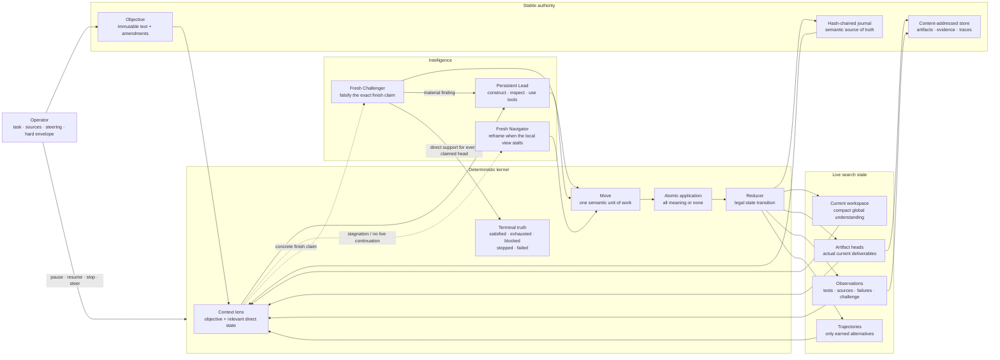

# Flourite, crystallized

This is the canonical object Flourite implements. It is intentionally smaller
than the source tree and more exact than a product tour.

> Flourite holds one objective still while an intelligent model repeatedly
> improves one live solution. It preserves the evidence and causal residue
> needed to escape local mistakes, widens only when the problem truly branches,
> and accepts completion only after a fresh inspection of the actual result.

## The whole system



This is one learning loop, not a sequence of phases.

## Canonical state

At a safe boundary the whole run is:

```text
Xₜ = ⟨O, Wₜ, Aₜ, Eₜ, Tₜ, Mₜ, Cₜ, Uₜ⟩
```

| Symbol | Meaning | Invariant |
| --- | --- | --- |
| `O` | Objective | Original text never changes; steering is an explicit amendment. |
| `Wₜ` | Workspace | One compact, expressive account of the current global understanding. |
| `Aₜ` | Artifact heads | The actual deliverables currently being developed. |
| `Eₜ` | Observations | Provenance-bearing evidence, tests, failure residue, and challenge findings. |
| `Tₜ` | Trajectories | A small set of alternatives opened only for real uncertainty width. |
| `Mₜ` | Moves | Proposed, running, and completed semantic units of work. |
| `Cₜ` | Finish claim | Exact satisfaction claims bound to an exact workspace and artifact digests. |
| `Uₜ` | Usage | Observed time, tokens, turns, tools, and cost against operator limits. |

The state contains structure needed for integrity and navigation. It does not
attempt to encode the task's semantic world into enums, issue graphs, roles, or
universal scores. That meaning stays in the workspace where the model can
reason about it directly.

## One transition

The transition law is deliberately plain:

```text
contextₜ = lens(O, Wₜ, Aₜ, relevant(Eₜ), Tₜ, recent(Mₜ), Uₜ)
resultₜ  = intelligent_move(contextₜ, full_capability_plane)
eventₜ   = compile(resultₜ, exact live state)
Xₜ₊₁    = atomic_transition(Xₜ, eventₜ)
```

A result may contain:

- observations and their raw evidence handles;
- a new artifact version and deliverables;
- a new workspace;
- a continuation move;
- optional branch trajectories;
- a finish claim or a genuine external blocker;
- actual usage and failure residue.

`MoveResultCompiler` turns the model/tool result into that one semantic fact;
it does not mutate state. `AtomicMoveTransition` validates identity, ownership,
lineage, digests, compare-and-swap, continuations, and terminal intent before
performing one mutation. `move.applied` then commits the complete fact in a
single ledger transaction. If compilation, validation, or persistence fails,
nothing becomes authoritative. Retrying the same move is idempotent.

This boundary is the core reliability primitive. Provider activity, tool calls,
and transcripts are useful evidence, but none is progress until the resulting
meaning is admitted atomically.

## Intelligence topology

### Lead

The Lead is the normal path. It receives the exact objective, current workspace,
direct evidence paths, current artifact paths, live trajectory heads, recent
moves, tools, and hard envelope. It may reason, research, inspect, code, render,
test, or use bounded nested tasks. Its session persists within a trajectory so
hard-won local understanding is not repeatedly discarded.

If that session disappears, Flourite reconstructs it from durable state. Hidden
conversation memory improves efficiency; it is never required for correctness.

### Navigator

The Navigator is not a manager and does not run every round. It gets a fresh
context when the local continuation vanishes or repeated Lead moves produce no
artifact or evidence change. Its job is to expose framing errors, missing
hypothesis classes, drift, repetition, or a more informative next move. It
cannot declare completion.

### Challenger

The Challenger appears only after the Lead makes a concrete finish claim. It is
fresh, read-only, and instructed to inspect the actual artifacts and evidence.
Support must bind to every claimed artifact digest. A stale review cannot bless
a changed result.

Material criticism and uncertainty veto completion and flow back into ordinary
construction. Non-material observations remain in the record without forcing
ceremonial repair. Successful deterministic adapter checks are evidence, but
they do not replace semantic challenge where the objective is semantic.

## Gradient flow

Flourite's gradient is not a synthetic quality score. It is the path by which a
real observation changes the next construction context:

```text
direct observation
      ↓
explicit provenance and scope
      ↓
workspace revision / artifact revision / branch decision
      ↓
next move sees the changed world
      ↓
fresh observation of the changed result
```

Negative results are retained because they remove parts of the search space.
Rejected finish claims are retained because they reveal exactly which claim or
artifact failed. A Navigator reframe is retained because it changes the global
workspace, not because another agent spoke.

An observation created after a workspace version cannot be marked as consumed
by that earlier workspace. This temporal rule prevents evidence from vanishing
before any model has seen it.

## Search width

Most runs remain one Lead and one artifact. A model may open a trajectory only
when two approaches need independent development before comparison. Each branch
has its own artifact head and Lead continuity. Branch work cannot overwrite the
global workspace; integration receives all heads and returns one new current
best.

Parallelism is therefore a maximum permission, not a target. Flourite does not
manufacture work to fill cores.

## Completion and stopping

There are five honest terminal states:

- `satisfied` — a concrete claim survived direct independent challenge;
- `exhausted` — an explicit operator envelope was reached;
- `blocked` — a real external dependency prevents progress;
- `stopped` — the operator stopped at a safe boundary;
- `failed` — the harness cannot continue correctly.

There is no default call cap, round cap, repair cap, or synthesis reserve. A
productive run continues until its claim is established or the operator's
explicit boundary says otherwise.

Pause, stop, and steering are admitted between moves. They never pretend an
in-flight call was cleanly integrated. A stopped or paused run remains
reconstructible from the journal.

## Ownership map

| Component | Owns | Must not own |
| --- | --- | --- |
| `IntelligenceKernel` | Next legal move, stagnation response, completion transition, envelope truth | Provider mechanics or domain semantics |
| `MoveResultCompiler` | Translate one typed execution result into one complete transaction plan | Mutating run state |
| `AtomicMoveTransition` | Aggregate invariants and all-or-nothing state mutation | Provider or model behavior |
| `KernelJournal` + reducer | Atomic append, event dispatch, legal replay, derived state | Model judgment or I/O policy |
| `OmpMoveRunner` | Context materialization, provider call, typed boundary, session recovery | Global state transitions |
| OMP provider | Transport attempts, schema retry, safe telemetry, exact usage | Search policy or semantic progress |
| Adapter | Artifact capture, direct checks, materialization, explicit apply | Universal search policy |
| `KernelEngine` | Run lifecycle, commands, locks, activity, source staging | Deciding what an observation means |
| Blob store | Immutable bytes and digest verification | Semantic authority |
| Live UI | Projection and operator input | Hidden state or progress claims |

The implementation maps directly to these boundaries:

```text
src/frontier_harness/
  core/          types · atomic transition · reducer · journal · intelligence kernel
  intelligence/ context lens · OMP runner · result compiler · typed contracts
  providers/     OMP transport · safe event projection · trace accounting
  runtime/       lifecycle · commands · typed activity · sources · materialization
  adapters/      domain observation and artifact behavior
  live.py        disposable operator projection
```

## What is deliberately absent

- fixed stage progression;
- permanent planner, researcher, critic, and manager personas;
- agent-to-agent free-form chat;
- a universal decomposition ontology;
- progress credit for model calls, prose, rewritten bytes, or tool activity;
- a second completion path outside the canonical reducer;
- hidden resource grants that can strand unused operator compute.

The old controller remains available only through the hidden `legacy-run`
compatibility command for controlled comparisons. Ordinary commands neither
import it nor branch through its state model.

## Open frontier

Within-run continuity, replay, branching, challenge, steering, and recovery are
implemented. Native cross-run learning is not yet part of the authoritative
kernel. When added, it must be retrieval with explicit provenance and scope—not
ambient lore that can silently bend a new objective.

That boundary is intentional. Flourite should remember transferable evidence
without making yesterday's local optimum today's hidden prior.
