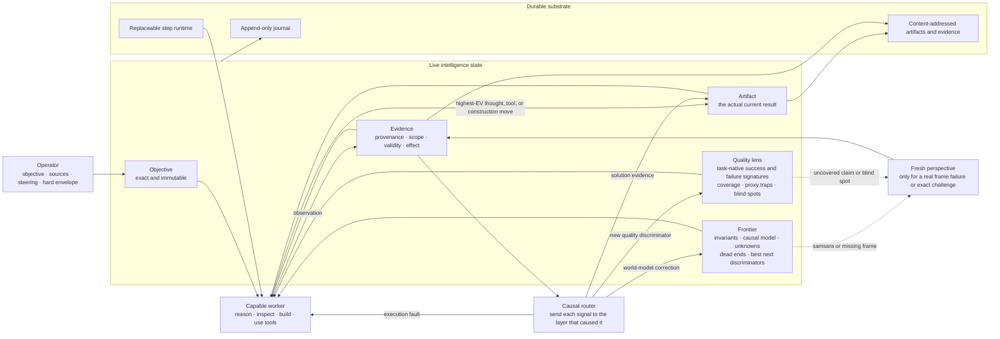

# Flourite, crystallized

Flourite is not an agent workflow. It is a feedback controller around a highly
capable model.

> Hold the real objective still. Give intelligence its full tool plane. Preserve
> the smallest world model that prevents forgetting and repetition. Let direct
> evidence change both the solution and the system's idea of quality. Spend the
> next unit of compute where it is most likely to change the result.

Durability keeps that loop alive. It is not a substitute for the loop.

## The complete object



The semantic state is deliberately small:

```text
X_t = < objective, frontier, quality lens, artifact, evidence, usage >
```

Everything else is execution machinery or a temporary view.

## The five semantic objects

### Objective

The exact user task and explicit amendments. It is never silently rewritten by
a planner, evaluator, reframe, summary, or prior run.

### Frontier

The shortest representation from which a fresh strong model can recover the
real problem state. It contains:

- current best causal understanding;
- load-bearing invariants and constraints;
- what has actually been established;
- unresolved uncertainties that could change the solution;
- failed approaches and why they failed;
- assumptions shared by apparently different approaches;
- the few next observations capable of changing a decision.

It is not a diary, backlog, issue graph, transcript summary, or performance
report. If it grows without making the problem easier to think about, it is
broken and must be recompressed.

### Quality lens

The evolving, task-native model of what a genuinely excellent result means. It
contains exact success and failure signatures, observable discriminators,
coverage gaps, known proxies that can be gamed, and unresolved blind spots.

The lens begins from the objective and supplied references. It changes only
when grounded evidence reveals a new distinction, a prior criterion is a bad
proxy, or an evaluator missed something material. A new criterion records why
it matters and how one could tell. Adjectives without a discriminator do not
become quality state.

The worker sees the live lens because it guides construction. A fresh
Challenger sees it as a fallible hypothesis: it must test both the artifact and
whether the lens itself omits a material dimension. This avoids the two common
failures of static rubrics: optimizing a stale proxy and sharing the same blind
spot forever.

### Artifact

The actual result, not prose about the result. Software is inspected and run;
media is watched and heard; a document is read; a research claim is traced to
evidence. Intermediate work may remain live, but only content-addressed heads
are eligible for exact evaluation or delivery.

### Evidence

A scoped observation with provenance, validity, and a declared consequence.
Negative evidence is first-class. A failure that removes part of the search
space is progress; a tool call or paragraph that changes no decision is not.

Evidence is never flattened into a generic score. Its job is to change the
frontier, quality lens, artifact, or confidence in a concrete claim.

## The control law

Each semantic step is:

```text
1. Recover the objective, frontier, quality lens, artifact, and new evidence.
2. Name the live decision or uncertainty with the greatest consequence.
3. Choose the cheapest move likely to discriminate it.
4. Prefer thought-space elimination when reasoning can settle it.
5. Use tools, code, research, or parallel work when observation is worth its cost.
6. Capture the result once, with provenance and scope.
7. Route the signal to the layer it actually updates.
8. Recompress the frontier and continue.
```

The worker is allowed to do a great deal inside one step. Flourite must not
split coherent work into ceremonial roles or calls merely to make activity
visible. Calls, commits, tests, reports, and agent count are costs—not progress
metrics.

There are no fixed phases, top-level call grants, synthesis reserve, mandatory
branch count, or review cadence. Only the operator sets a hard resource
envelope. Inside it, compute allocation follows expected decision value.

## Signal routing

A failure is useful only if it reaches the layer capable of learning from it.

| Signal | Correct destination | Never treat it as |
| --- | --- | --- |
| Artifact is wrong | Worker revises the earliest falsified premise or construction | A request for more ceremony |
| Frontier is wrong or stale | Recompress or invoke one fresh perspective | A local artifact patch |
| Quality lens missed a material distinction | Amend the lens, then re-evaluate affected claims | A one-off grader comment |
| Assay cannot access or perceive its target | Repair/rematerialize the assay and replay the exact evaluation | Uncertainty about artifact quality |
| Provider/runtime failed | Retry the exact semantic move after infrastructure recovery | A new semantic task |
| Same bet repeats without information gain | Expose the repeated assumption and force a different discriminator | Permission to run the same loop longer |
| Real external dependency is absent | Pause with the exact blocker | Model difficulty or low confidence |

This router is a causal boundary, not an issue taxonomy. The semantic content
remains free-form in the frontier and lens; only the destination of a signal is
typed.

## Conservation and ownership

Intelligence is lost when a boundary destroys the state needed to answer it.
Every activity therefore owns its live context and candidate until the receiver
has semantically admitted the handoff.

```text
author owns context + candidate
        ↓ present exact digest
receiver admits ───────────────────────────────→ commit + release context
        │
        └─ rejects with exact reason + digest
                         ↓
             same author corrects in place
                         ↓
                   present again
```

Rejection is information, not garbage collection. It may archive a candidate,
but it cannot erase the workspace, conversation, evidence, or correction target
before the author has consumed the rejection. A lost provider session is
reconstructed from the same objective, capsule, candidate digest, and rejection;
it does not become a new semantic task.

The same conservation rule applies to learning. Every material evaluator signal
has an explicit disposition: integrated into a named discriminator, superseded
by stronger evidence, or kept unresolved. Prior discriminators cannot disappear
between versions without an evidence-grounded retirement record. Logs are
append-only; a convenient latest-error view never replaces history.

Independent artifacts also have independent failure domains. Failure of one
solver, validator, or grader cannot cancel healthy work in another family. A
supervisor restart reattaches to a matching live process or resumes the exact
durable activity; it never assumes that “controller restarted” means “model work
must be discarded.”

## The evaluation handshake

An evaluator cannot judge evidence it cannot access. Accessibility and semantic
judgment are separate states.

```text
materialize exact digest
        ↓
write relative manifest + hashes
        ↓
preflight: objective, artifact, references and required viewers are readable
        ↓
VALID ASSAY ── inspect the whole decision-relevant artifact ── semantic verdict
        │
        └─ INVALID ASSAY ─ request exact missing material
                              ↓
                     rematerialize from durable state
                              ↓
                     replay the same evaluation
```

The evaluator starts inside the capsule it must inspect. Durable manifests use
workspace-relative paths and content digests; models are never asked to retype
long ephemeral absolute paths. An inaccessible file, unsupported modality,
unfinished render, or missing reference emits `assay_invalid`, not `uncertain`,
`supports`, or `challenges`.

The runtime services a typed missing-material request by rematerializing the
capsule from content-addressed state, then repeats the exact evaluation against
the same digest. If the assay still cannot be made valid, the durable run pauses
with the assay failure recorded.
It cannot satisfy the objective, revise the artifact, or contaminate the quality
gradient.

Once valid, every material verdict is authoritative regardless of whether it
arrived as prose, a direct test, or a domain-native inspection. Mechanical
checks may establish only the named properties they actually observe. A valid
file, build, checksum, or duration can never stand in for semantic quality.

## Evolving judgment

Evaluation evolves at two distinct timescales.

### Inside one run

The quality lens is live. Direct failures, newly discovered trade-offs, user
steering, and Challenger blind-spot findings amend it immediately. Any claim
depending on the old lens is reopened. The artifact and the evaluator therefore
learn from the same evidence without becoming the same agent.

### Across runs

External benchmarks stay frozen within an experimental epoch so comparisons
remain honest. After an epoch, grounded misses may produce a new evaluator
version with explicit provenance and held-out checks. The next epoch freezes
that version. Evolution without versioning destroys measurement; freezing
forever destroys learning.

Two blind planes make this operational:

- the **anchor** is fixed and preserves comparability;
- the **adaptive frontier** contains versioned discriminators, proxy traps,
  probes, and blind spots learned from prior grounded evidence.

Both inspect the same randomized artifact packet independently. The adaptive
plane can veto a promotion when it reproduces a learned failure; it cannot
rewrite the anchor or see its verdict. Their disagreement is itself conserved
as evidence and withholds promotion rather than being averaged away. After
grading, a separate learner inspects the real artifacts, both scorecards,
external validation, and inner Challenger quality deltas. Its next frontier is
accepted only when every input signal and every prior criterion is accounted
for.

Candidate workers do not see hidden benchmark cases or grader scores. Transfer
must come from a general causal Flourite change, not evaluator imitation.

## The always-work contract

“Always works” does not mean inventing success when a dependency is truly
absent. It means every attempted activity reaches exactly one intelligible
state:

1. **accepted** — its semantic result commits;
2. **correcting** — the same actor has the exact rejection and retained work;
3. **recovering** — infrastructure is rematerializing or reattaching the exact
   activity;
4. **blocked** — a named external fact is missing and no in-scope action can
   create it.

There is no fifth state where work silently vanishes, a timer loops forever, a
sibling cancellation destroys a healthy artifact, or a template parser turns a
recoverable mismatch into a new run. Durable machinery exists to preserve these
semantic states, not to dictate how an intelligent worker must think.

## Anti-samsara

The common failure is not lack of intelligence. It is a strong model repeatedly
thinking inside the same representation.

Flourite detects repetition by semantic residue, not wording:

- the same load-bearing assumption survives unchanged;
- the artifact and evidence frontier do not materially move;
- successive actions could change the same decision in the same way;
- tool use repeats without increasing discriminative power;
- complexity rises while explanatory compression falls.

The live workspace therefore names one stable `decision_boundary`: the exact
decision or uncertainty whose resolution would most change the result. A fresh
reframe is triggered only when consecutive Lead moves remain on that boundary
without changing the artifact or adding durable evidence. Moving to a genuinely
new boundary through thought-space elimination counts as progress.

At that point a fresh perspective receives the objective, compressed frontier,
quality lens, artifact, and negative evidence—not the long conversation. Its
only job is to identify the hidden shared assumption, missing representation,
or better discriminator. The persistent worker then owns the decision and
construction. Flourite does not create a permanent manager caste.

## Search width

One worker and one live artifact are the default. Independent trajectories are
opened only when alternatives make genuinely different predictions and need
separate development before comparison. Shared uncertainty is solved once.
Parallelism is permission, not a utilization target.

The best branch is not selected by rhetoric or activity. It wins on direct
decision-relevant evidence, and useful parts of rejected branches return to the
frontier before their contexts are discarded.

## Completion

A finish claim names the exact objective claims, artifact digests, quality-lens
version, and evidence on which it depends. Satisfaction requires:

1. a valid assay inspected every claimed artifact in its decision-relevant form;
2. direct material support for the actual semantic claims—not proxy checks;
3. no unresolved material `challenges` or `uncertain` verdict;
4. no uncovered material dimension in the current quality lens;
5. no stale evidence or evaluator result from another digest or lens version.

Material support also names the exact satisfaction-claim strings it inspected.
Artifact coverage without semantic-claim coverage cannot terminate the run.
Pending operator steering must be integrated into the live workspace before a finish
claim is legal. If the last allowed model call completes an already-sufficient proof,
the zero-compute satisfaction transition is applied before exhaustion is recorded.

Non-material support cannot close a material claim. Invalid assays cannot vote.
Changing an artifact, objective amendment, or load-bearing quality criterion
revokes affected support automatically.

Honest terminal states are `satisfied`, `exhausted`, `blocked`, `stopped`, and
`failed`. Productive work ends only through established satisfaction or an
operator-owned boundary.

## Durable execution

The journal records one atomic semantic move: its evidence, artifact, frontier,
quality-lens update, continuation, and usage commit together or not at all.
Retries are idempotent, and every proposal is bound to the exact causal event frontier
that produced it, so new evidence can legitimately reopen the same semantic question
without becoming a duplicate or a zero-cost loop. Blobs are immutable. A snapshot is
accepted only when it matches the journal head; otherwise the projection is rebuilt from
the verified journal automatically.

Runtime components are replaceable at move boundaries. A provider, adapter,
prompt, compiler, or evaluator implementation may be repaired and rebound
without reconstructing the run. In-flight code never changes beneath a tool
call. A repair is accepted only when replaying the exact failed activity works;
repair prose has no authority.

The supervisor leases one component generation, runs one step, verifies its
receipt, and repeats. It owns no planning or quality judgment.

Execution pauses identify the causal recovery domain: provider, assay,
component, or external. Only component failures may invoke code repair. A real
external blocker must retain durable evidence; difficulty or model uncertainty
cannot masquerade as a blocked terminal state.

## What must remain absent

- agent societies and permanent planner/researcher/critic casts;
- fixed phase progressions or call allocations;
- universal issue graphs or generic quality scores;
- free-form agent chatter as the control plane;
- progress credit for activity, prose, commits, or tool count;
- static rubrics treated as truth forever;
- evaluators that cannot ask for missing material;
- semantic conclusions drawn from infrastructure failures;
- proxy checks promoted beyond their observable scope;
- a second completion path outside the canonical reducer.

## Implementation map

```text
core/          objective · frontier state · typed evidence · atomic transition · journal
intelligence/  context · worker · fresh perspective · assay handshake · result compiler
runtime/       replaceable steps · recovery · operator commands · source staging
providers/     transport and usage only
adapters/      artifact-native observation and deterministic property checks
live.py        disposable projection; never semantic authority
```

The source tree may be larger than this map. Its behavior may not be.
